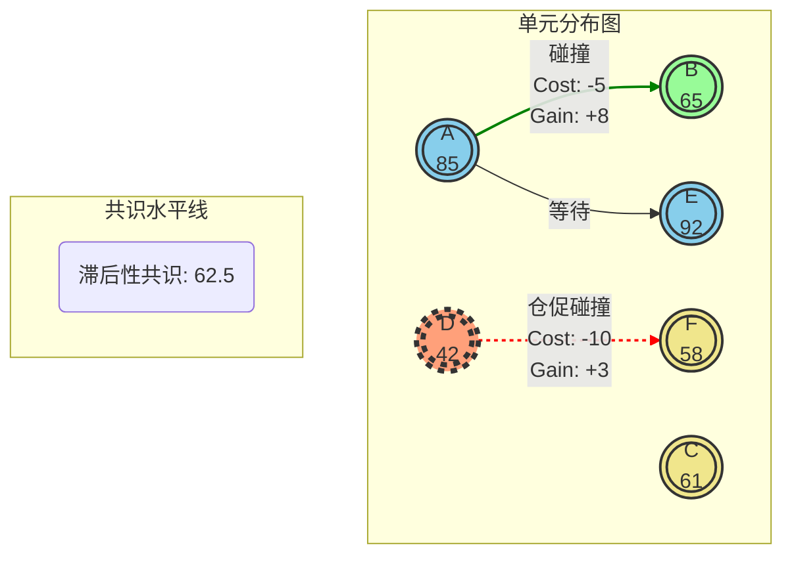

# 50 - 多单元互动模拟器 (Multi-Agent Interaction Simulator)

**返回主导航:** [00-主导航](00-主导航.md)

---

## 1. 模拟器核心理念

本模拟器旨在可视化一个基于“碰撞”、“变形”与“减熵”的复杂适应系统。系统中的每个单元（Agent）在“滞后性共識”的社会压力和自身发展的内在驱动下，做出“主动碰撞”或“等待时机”的决策，以期在充满不确定性的环境中实现有序发展（减熵）。

- **核心机制**: 单元通过“碰撞”交换/组装“零件”（资源/信息），实现“变形”（适应/进化）。
- **核心决策**: 基于自身进度与滞后共识的差距，权衡风险与回报。
- **核心目标**: 对抗熵增，实现从无序到有序的结构化发展。

---

## 2. 模拟器界面设计

### 2.1. 全局状态监控 (Global State Dashboard)

| 指标 (Metric) | 当前值 | 趋势 | 描述 |
| :--- | :--- | :--- | :--- |
| **外在实际发展 (Objective Reality)** | `75.8` | `↑` | 系统的真实、客观发展水平（对单元不可见）。 |
| **滞后性共识 (Lagging Consensus)** | `62.5` | `→` | 群体对“平均水平”的普遍认知，是社会压力的来源。 |
| **系统熵值 (System Entropy)** | `0.89` | `↓` | 系统的混乱程度。目标是降低此值。 |
| **碰撞频率 (Collision Frequency)** | `3.2/秒` | `↑` | 系统内单元互动的频率。 |

### 2.2. 单元观察区 (Agent Observation Area)

这是一个动态的可视化区域，展示所有单元的实时状态。

**图例说明:**
- **圆圈**: 代表一个单元（Agent），内部数字是其“自身发展进度”。
- **节点颜色**: 代表单元的健康度或资源水平（例如，蓝色=健康，黄色=正常，红色=受损）。
- **边框样式**: 虚线/粗边框代表该单元正处于高风险状态（例如，单元D，进度42远低于共识62.5，有被边缘化的风险）。
- **箭头**: 代表“碰撞”事件。绿色代表高质量碰撞，红色代表仓促/损伤性碰撞。

### 2.3. 选中单元详情 (Selected Agent Details)

*当点击某个单元（例如单元D）时，显示详细信息。*

- **ID**: `Unit-D`
- **自身发展进度**: `42.0`
- **与共识的差距**: `-20.5` (低于共识)
- **当前状态**: `高风险 - 边缘化压力`
- **决策倾向**: `主动/仓促碰撞 (Aggressive/Risky Collision)`
- **零件（资源）**: `[核心模块 v1.2, 传动装置 (受损), 传感器 v0.8]`
- **历史碰撞记录**:
  - `与单元F碰撞：代价-10，收益+3`
  - `与单元X碰撞：代价-5，收益+2`

---

## 3. 模拟控制器 (Simulation Controls)

- **播放/暂停/快进**: 控制模拟的进行。
- **重置模拟**: 恢复到初始状态。
- **参数调整**:
  - **共识滞后系数**: `[滑动条, 0.1 - 1.0]` (调整共识更新的速度)
  - **碰撞损伤率**: `[滑动条, 0% - 50%]` (调整仓促碰撞的代价)
  - **发育速度**: `[滑动条, 0.5 - 2.0]` (调整单元自我发展的速度)

---

## 4. 互动日志 (Interaction Log)

| 时间 | 事件类型 | 参与方 | 代价/收益 | 描述 |
| :--- | :--- | :--- | :--- | :--- |
| 10.5s | **高质量碰撞** | A (85) ↔ B (65) | A:[-5,+8], B:[-3,+10] | 单元A与B在发展水平匹配时发生互动，双方均获得显著收益。 |
| 10.2s | **仓促碰撞** | D (42) → F (58) | D:[-10,+3], F:[-1,+1] | 单元D为追赶共识，与F发生损伤性碰撞，收益低微。 |
| 9.8s | **自我发育** | E (92) | N/A | 单元E选择等待，自身零件复杂度提升。 |
| ... | ... | ... | ... | ... |

---

**下一步:**

- [设计具体的“零件”组装与“变形”规则](link-to-rules-design.md)
- [分析不同参数下的系统长期演化趋势](link-to-analysis.md)
